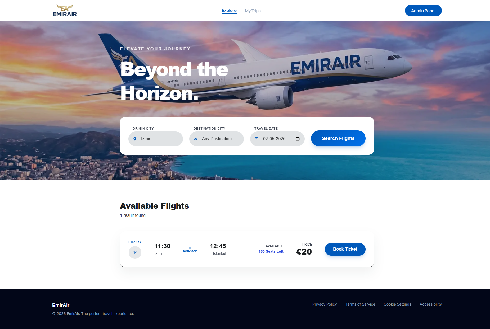

# EmirAir Frontend

This is the frontend for EmirAir, a flight booking application built with Next.js and Tailwind CSS. It provides a user-friendly interface for searching flights, booking tickets, and managing trips. It also includes a secure admin panel for site administrators.

## Live Demo

The live application is deployed on Vercel and can be accessed here:
[https://emir-air-frontend.vercel.app](https://emir-air-frontend.vercel.app)

## Features

*   **Flight Search:** Users can search for available flights based on origin, destination, and date.
*   **Booking System:** A multi-step checkout process allows users to book their selected flights by providing passenger details.
*   **My Trips:** A dedicated page where users can retrieve their booking details using their email address.
*   **Admin Panel:** A protected section for administrators with features like:
    *   Viewing all bookings grouped by flight.
    *   Adding new flights to the system.
    *   Secure login for admin access.

## Technologies Used

*   **Framework:** [Next.js](https://nextjs.org/) (React)
*   **Styling:** [Tailwind CSS](https://tailwindcss.com/) for a utility-first CSS workflow.
*   **Icons:** [Iconify](https://iconify.design/) for a wide range of SVG icons.
*   **Deployment:** [Vercel](https://vercel.com/)
## Screenshots



## Getting Started

To get a local copy up and running, follow these simple steps.

### Prerequisites

Make sure you have Node.js (version 18.x or newer) and npm installed on your machine.

### Installation & Setup

1.  **Clone the repository:**
    ```sh
    git clone https://github.com/EmirBakkal0/EmirAir-Frontend
    cd emirair-frontend
    ```

2.  **Install dependencies:**
    ```sh
    npm install
    ```

3.  **Set up environment variables:**
    Create a `.env` file in the root of your project and add the URL for your backend server.
    ```
    NEXT_PUBLIC_BACKEND=https://emirair-backend.vercel.app
    ```

    or go to the backend repo found here https://github.com/EmirBakkal0/emirair-backend to run the backend on local. Follow the steps there annd add the localhosted backend link to .env
    ```
    NEXT_PUBLIC_BACKEND=http://localhost:5000
    ```

5.  **Run the development server:**
    ```sh
    npm run dev
    ```
    Open [http://localhost:4000](http://localhost:4000) with your browser to see the result.

## Build for Production

To create a production-ready build, run:
```sh
npm run build
```
This will create an optimized build in the `.next` folder. You can then start the production server with:
```sh
npm start
```

